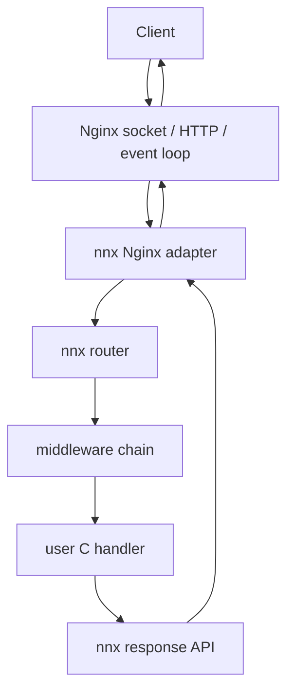

# nnx

**nnx** is an experimental Echo-inspired web framework for C that executes application handlers directly inside Nginx workers.

> **Status:** v0.1.0. The public API is pre-v1 and may still change before v1.0.

Nginx remains an external dependency. nnx does not vendor or fork Nginx.

## Why nnx?

The goal is a small C application API while keeping Nginx responsible for HTTP parsing, sockets, the event loop, request pools, output filters, and the worker lifecycle.

```c
#include <nnx.h>
#include <nnx/middleware.h>

static void hello(nnx_ctx *ctx)
{
    nnx_json(ctx, 200, "{\"message\":\"hello from nnx\"}\n");
}

int nnx_register(nnx_app *app)
{
    if (nnx_use(app, nnx_logger()) != 0)
        return -1;
    if (nnx_use(app, nnx_request_id_middleware()) != 0)
        return -1;
    return nnx_get(app, "/", hello);
}
```

Application code never includes an Nginx header and no `ngx_*` type appears in the public nnx API.

## Quick start

### Linux

```sh
sudo apt-get update
sudo apt-get install -y build-essential libpcre2-dev zlib1g-dev curl
```

### macOS

Install Xcode Command Line Tools and PCRE2:

```sh
xcode-select --install
brew install pcre2
```

### Run the bundled example

nnx is currently tested against **Nginx 1.30.5**.

```sh
git clone https://github.com/Hen00af/nnx.git
cd nnx

curl -fsSLO https://nginx.org/download/nginx-1.30.5.tar.gz
tar xzf nginx-1.30.5.tar.gz

./scripts/run-example.sh ./nginx-1.30.5
```

In another terminal:

```sh
curl http://127.0.0.1:8080/
# Hello, nnx!
```

### Run your own application

Create `app.c` with an `nnx_register()` function, then:

```sh
./scripts/run-app.sh ./nginx-1.30.5 ./app.c
```

An optional third argument selects the development port:

```sh
./scripts/run-app.sh ./nginx-1.30.5 ./app.c 9000
```

The current runner is development tooling. A dedicated `nnx run app.c` CLI is planned.

## Current features

- GET / POST / PUT / PATCH / DELETE / HEAD / OPTIONS / Any route registration
- static routes, `:param` routes, and `*` wildcards
- HEAD fallback to GET when no explicit HEAD handler exists
- 405 responses with an `Allow` header
- duplicate exact route registration rejection
- nested route groups and group-scoped middleware
- composable middleware with before/after unwind
- Logger, RequestID, CORS, BasicAuth, Secure headers, and BodyLimit middleware
- query, header, cookie, form, body, host, scheme, and client-IP access
- request-scoped allocation and context key/value storage
- asynchronous Nginx request-body read before application dispatch
- text, JSON, HTML, blob, redirect, headers, and response cookies
- central/default error handling for 404 / 405 / 413 / 500
- real Nginx integration tests on Linux CI
- ASan + UBSan unit-test coverage

## Architecture



The core boundary is intentional:

```text
application API
      |
   nnx core
      |
adapter contract
      |
Nginx adapter
      |
    Nginx
```

Router, middleware, context, and response logic remain Nginx-independent. Nginx-specific headers and APIs stay under `src/adapter/nginx/`.

See the ADRs in `docs/adr/` for the process/runtime decisions.

## Routing semantics

Route priority is:

```text
static > :param > *
```

An explicit HEAD route wins. If no HEAD route matches, nnx falls back to the matching GET route; Nginx's `header_only` behavior prevents the response body from being emitted.

OPTIONS is explicit-route or middleware driven in v0.1. If a path exists but no OPTIONS handler or middleware answers it, nnx returns 405 with an `Allow` header.

Registering the same method and exact route pattern twice is rejected. An `Any` route also conflicts with a method-specific route on the same exact pattern. Broader ambiguous-pattern detection is still future work.

## Request body model

nnx uses `ngx_http_read_client_request_body()` asynchronously and dispatches the application only after the body is available. In-memory and Nginx temp-file-backed bodies are copied into request-pool-backed memory before dispatch.

`nnx_body_limit()` currently enforces an application limit **after** Nginx finishes its asynchronous body read. Early adapter-level rejection is a future optimization; Nginx's own configured request-size limit still applies independently.

## Ownership and lifetimes

These rules matter in C:

- `nnx_free(app)` releases routes, groups, and middleware state owned by the app.
- successful `nnx_use()` / `nnx_group_use()` transfers ownership of `middleware.data` to nnx when a `destroy` callback is provided.
- failed middleware registration also invokes the supplied `destroy` callback.
- `nnx_ctx_set(ctx, key, value)` is **non-owning**; nnx does not free arbitrary stored pointers.
- use `nnx_alloc(ctx, size)` for request-scoped data that should live until the current request pool is destroyed.
- request-derived pointers should be treated as request-lifetime values unless an API explicitly documents otherwise.

See `docs/ownership.md` for details.

## Blocking I/O

Handlers currently use a synchronous C callback API:

```c
typedef void (*nnx_handler)(nnx_ctx *ctx);
```

A blocking database call, filesystem operation, or network request inside a handler blocks that Nginx worker. nnx does not hide blocking work behind fake asynchronous semantics.

An external-I/O async model is intentionally deferred until it can be designed around the Nginx event lifecycle correctly.

## Fault isolation

nnx does **not** attempt to catch `SIGSEGV` / `SIGBUS` and continue executing inside a potentially corrupted process. Production-style fault isolation should use Nginx's master/worker process boundary.

The current `scripts/run-app.sh` development runner uses `master_process off` for a simpler foreground debugging experience, so worker respawn isolation is not provided by that development mode yet.

## Testing

Unit tests:

```sh
make test
```

ASan + UBSan:

```sh
make test-sanitize
```

Real Nginx integration:

```sh
make integration NGINX_SRC=/path/to/nginx-1.30.5
```

CI runs unit tests, sanitizers, builds Nginx 1.30.5, loads the nnx dynamic module, and exercises the framework through real HTTP requests.

## Runtime model

Application handlers are compiled into the Nginx-loadable module. This is necessary because a C function pointer registered before `exec()` cannot survive into an unrelated Nginx process image.

Conceptually:

```text
app.c
  |
nnx build tooling
  |
  +-- nnx core
  +-- Nginx adapter
  +-- application handlers
          |
          v
ngx_http_nnx_module.so
          |
          v
    Nginx worker
```

See `docs/adr/0001-runtime-model.md`.

## Project status

v0.1.0 is the first public release of nnx. The broader framework roadmap is tracked in GitHub issue #19.

## License

nnx is released under the MIT License. See `LICENSE`.
